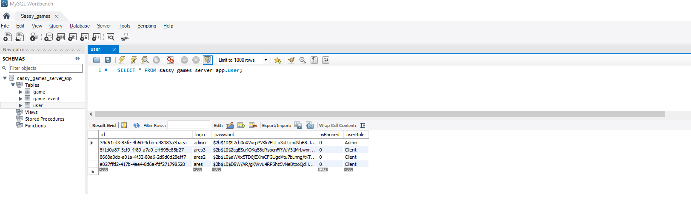
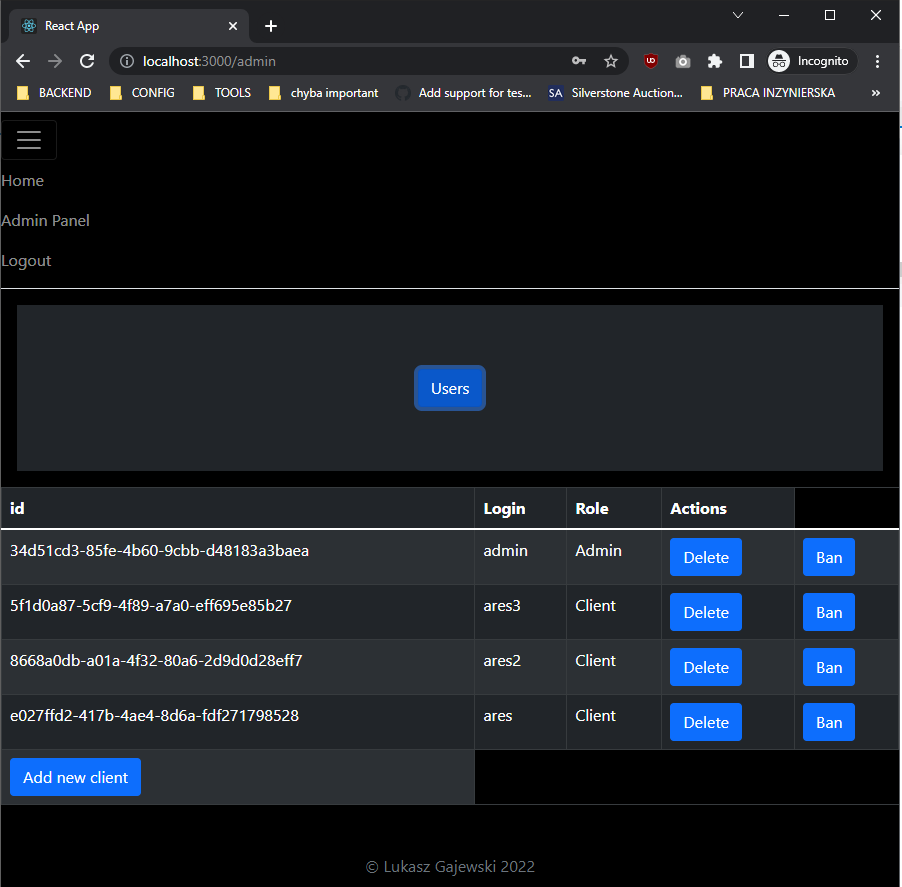
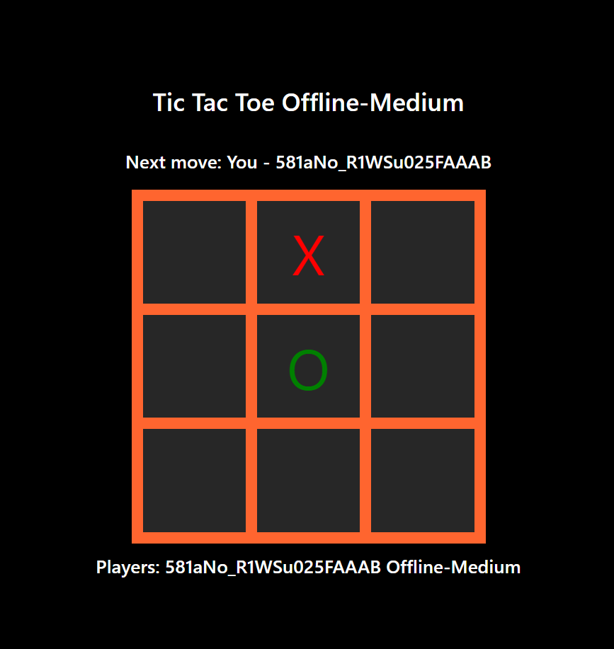
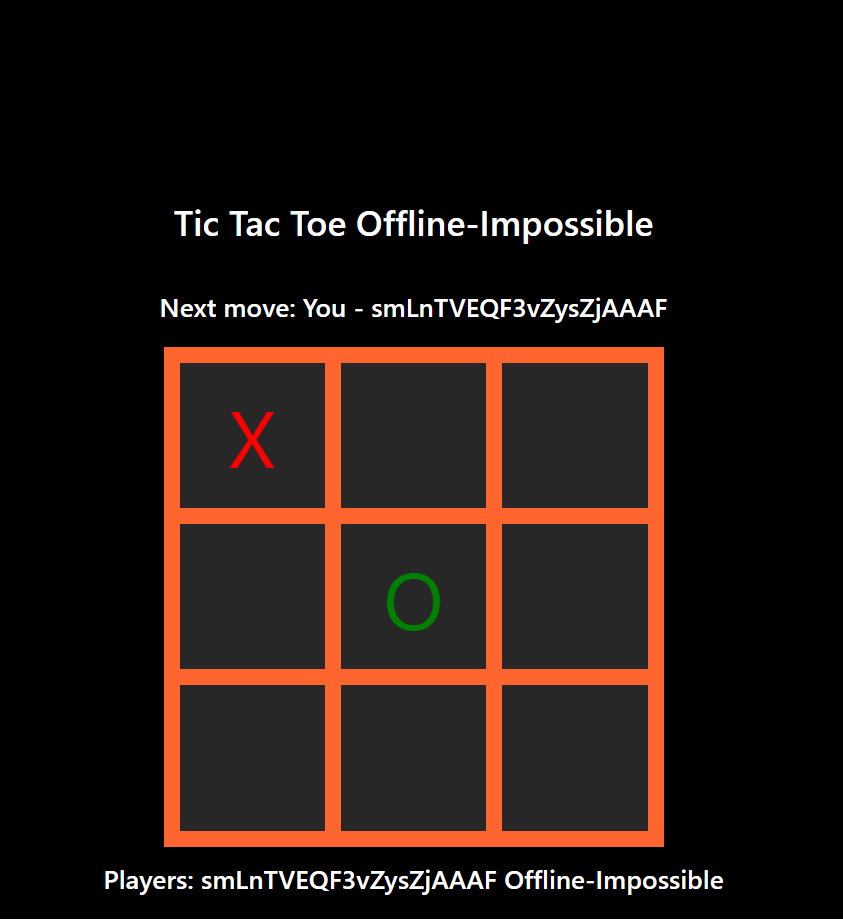
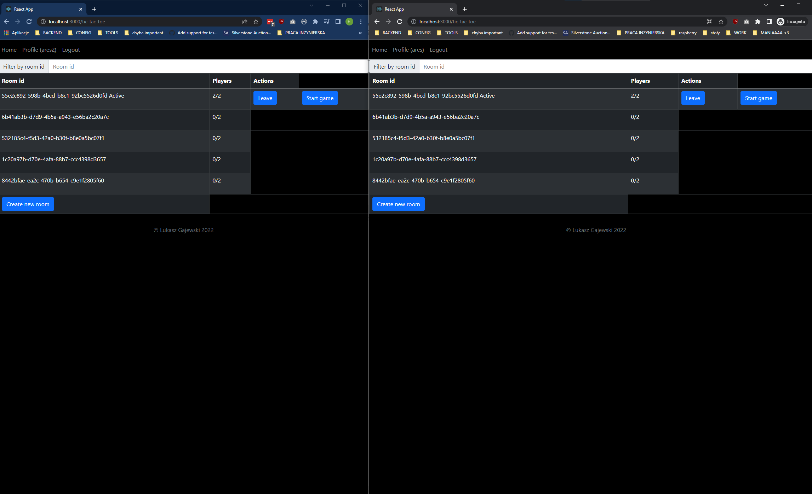
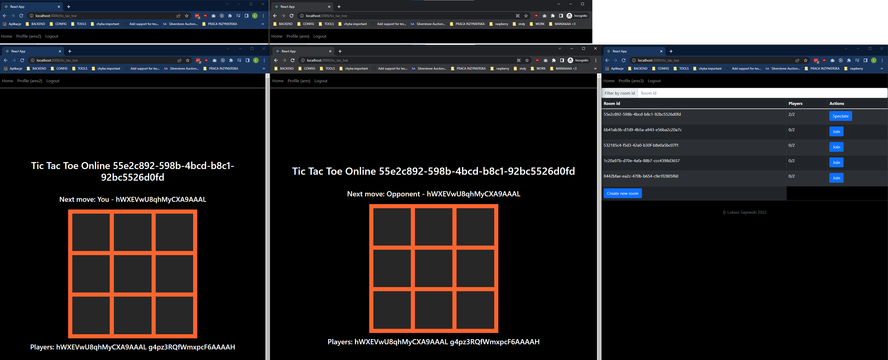
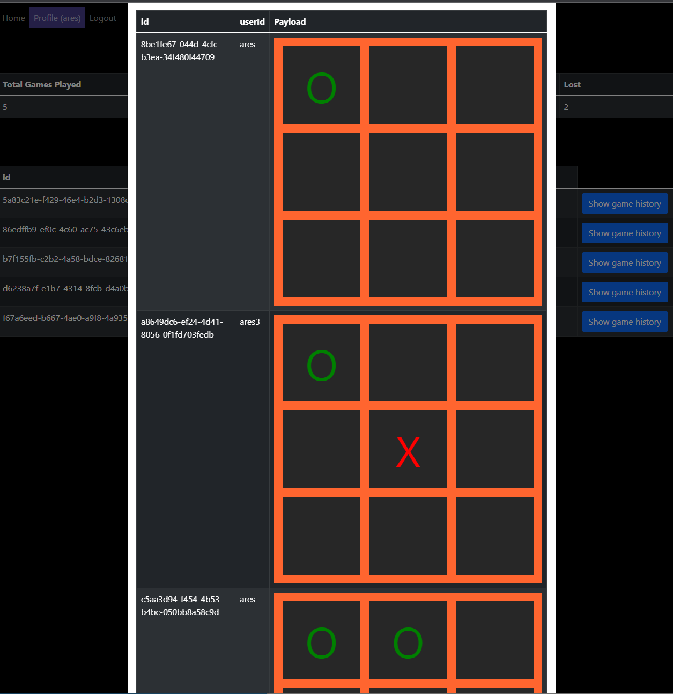

# Sassy-Games

## Things done to run the demo app easier
To make running the application as simple as possible I've decided to split the app in only two packages.
To reduce the need of duplicating some code (e.g. request models) generally I'd add a 3rd package (common) and put the code that needs to be shared between frontend and backend inside of it.
To use it, there would be a need to link or install that package though, so I've decided to duplicate those pieces of code.

JWTs are being signed / verified using a value coming from env variables (**JWT_KEY**) which also has been set to permanent value inside of server/package.json file. 
On production server this should definitely be replaced.

## Requirements 
Node, Docker Desktop (I've been developing and testing the app on Windows).

## Starting app
- docker-compose up -d
- client is available on http://localhost:3000, api on http://localhost:18200 and db on http://localhost:18202

## Project description and things TODO
1. Once client is started, user can visit main page on **http://localhost:3000/home**. User can see list of available games (1 in this case), with some stats (total games played, ongoing games count). Stats could be turned into information provided via socket to make them live. The values are provided using HTTP request and will only be updated once the page is refreshed. If the users tries to enter the game page he is redirect to login page.
2. User can register a new account on **http://localhost:3000/register**. I've created my own authentication service (reused code from my thesis). The information are being started in the user table. 

Password is being encrypted / decrypted using bcrypt package. User gained the **isBanned** field for the future usage. When registered successfully user gains the Client role.
3. User can sign in on **http://localhost:3000/login**. 
    - If user with Admin role signs in, he is able to perform some simple actions on user table. This panel could potentially be extend in the future to manage the games as well. 
    
    - If user with Client role signs in, he is redirected back to home page. The token is being stored in the redux store. When logging in, user is getting connected to the socket server as well (authentication is being verified with the same token). The authentication is verified only on connect.
4. If logged in the user can enter the tic tac toe game page. From there user can select 4 modes. 
    - Offline - Easy -> In this mode AI responds with totally random move.
    - Offline - Medium -> In this mode in second move AI tries to either take the middle or occupy one of the fields on the "cross". 
    
    After that AI tries to perform blocking / winning move. User is able to win if he performs a correct set of moves.
    - Offline - Impossible -> In this mode in second move AI tries to either take the middle or occupy one of the fields on the "edges".
    
    After that AI tries to perform blocking / winning move. As second move is always done to the edge, the user can only draw / lose, that's why I've named this mode "impossible"
    - Lobby
        - User is able to create new rooms (this should have some limits).
        - User is able to join the room (one at a time)
            - If the user tries to open a new tab, he won't be able to see the lobby. I'm keeping list of users connected to socket server and not allowing second connection. This should be also verified on a frontend side with a proper message to the user that he can only use one tab on a time.
        - When two users are in the same room, they are able to start a game. Once any user presses "Start game" the game starts for both. 
        
        - If any user quits the game while it has not ended yet, they are able to rejoin the same room. This is not finished feature, as they will start from "step 0". Game events should be fetched from the server to restore the previous state of game.
        - While the game is ongoing, 3rd user is able to spectate the game (it has the same problem which was described in the previous mode with setting a game to current point, it works correctly if the user starts spectating from step 0).
        
        - Game history is being stored in two separate tables in the database, one holds the information after the game itself and the second one stores the information about the game events. They can be matched by the id. These tables are generic so they are ready to hold the information for different type of games if we would like to extend this app.
5.  Logged user can see his statistics and game history on **http://localhost:3000/profile**. 
    - Game history is being restored out of the game_events from the database. The tic tac toe game board component is being used to preview the steps of the game.
    

## Enhancements ideas
1. Add more logs with info
2. Make logging methods more generic + gather more info (stackTrace, classname and etc.)
3. Improve code around sockets. Code should either become more generic (generic methods to handle e.g. room creation with specific game type inside of payload)
or more specific (more methods attached to a specific game). 
4. Add better transports for logs.